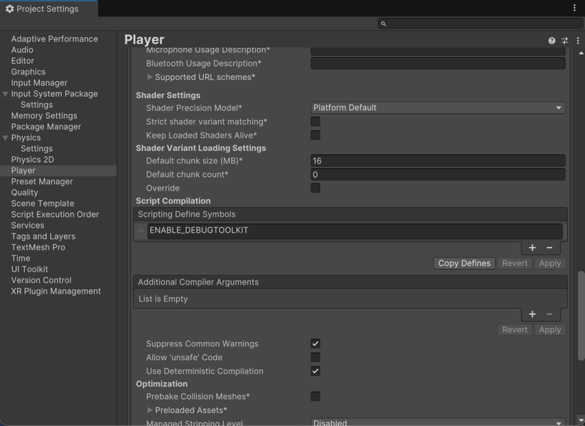
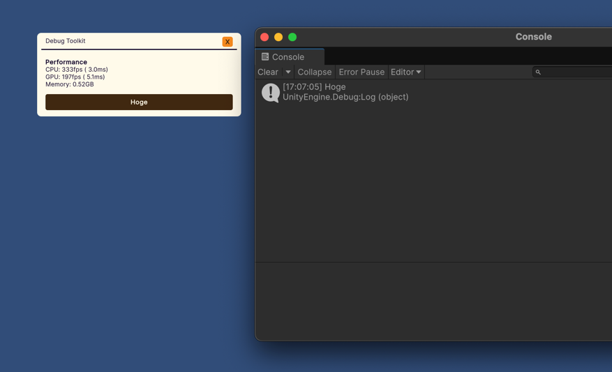
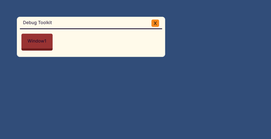
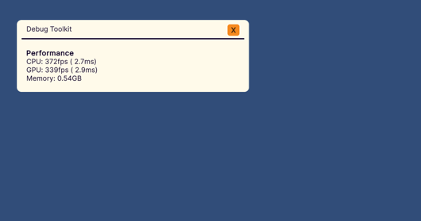

[](https://github.com/AndanteTribe/DebugToolkit/actions/workflows/unity-test.yml)
[](https://deepwiki.com/AndanteTribe/DebugToolkit)
[](README_JP.md)
# DebugToolkit

DebugToolkit is a library that makes it easy to build runtime debug menus.


## Overview

DebugToolkit helps you quickly create runtime debug UIs using Unity UIToolkit without writing USS styles. You can build and operate everything with C# scripts only. It provides useful features for development and debugging such as creating draggable debug windows, showing performance information, viewing console logs, and a text field with undo/redo history.

### Concept
DebugToolkit is designed based on the following concepts:

1. Add debug features using C# code only
2. Engineers don’t need to worry about layout and styling
3. Minimal and low dependency

## Quick Start

### Install

Download a Unity package from [Releases](https://github.com/AndanteTribe/DebugToolkit/releases), or add via Package Manager using the following URL:

```
https://github.com/AndanteTribe/DebugToolkit.git?path=Packages/jp.andantetribe.debugtoolkit
```

### Setup
Add the following to Project Settings > Player > Other Settings > Script Compilation > Scripting Define Symbols: `ENABLE_DEBUGTOOLKIT`.



### Basic Usage

1. Create a class that inherits `DebugViewerBase`
2. Override `CreateViewGUI()`
3. Implement your debug menu inside `CreateViewGUI()`
4. Call `Start()` at runtime

### Example

```csharp
using DebugToolkit;
using UnityEngine;
using UnityEngine.UIElements;

public class MyDebugView : DebugViewerBase
{
    protected override VisualElement CreateViewGUI()
    {
        var root = base.CreateViewGUI();

        // Add performance info label
        root.AddProfileInfoLabel();

        // Add a button
        var button = new Button() { text = "Hoge" };
        button.RegisterCallback<ClickEvent>(_ => Debug.Log("Hoge"));
        root.Add(button);

        return root;
    }
}
```

```csharp
using UnityEngine;

public class DebugInitializer : MonoBehaviour
{
    private MyDebugView _debugView;

    void Start()
    {
        _debugView = new MyDebugView();
        // Build the debug menu
        _debugView.Start();
    }
}
```




### Toggle All Visibility
While using DebugToolkit, a toggle button is shown at the bottom of the screen. Pressing it toggles visibility of all debug windows. You can also restore windows that you’ve hidden.

## Samples

You can import `Samples` from Package Manager to try sample scenes and scripts.

## Extension Methods

### `VisualElement AddWindow(this VisualElement root, string windowName)`
Adds a new debug window.
```csharp
public class MyDebugView : DebugViewerBase
{
    protected override VisualElement CreateViewGUI()
    {
        var root = base.CreateViewGUI();

        var window = root.AddWindow("Window1");
        window.Add(new Label("This is New Window"));

        return root;
    }
}
```



### `void AddConsoleView(this VisualElement root)`
Adds a console log viewer. You can check Unity’s console logs at runtime.
```csharp
public class MyDebugView : DebugViewerBase
{
    protected override VisualElement CreateViewGUI()
    {
        var root = base.CreateViewGUI();

        root.AddConsoleView();

        return root;
    }
}
```


### `void AddProfileInfoLabel(this VisualElement root)`
Adds a label that shows performance information.
```csharp
public class MyDebugView : DebugViewerBase
{
    protected override VisualElement CreateViewGUI()
    {
        var root = base.CreateViewGUI();

        root.AddProfileInfoLabel();

        return root;
    }
}
```


### Unity 2023.2 or newer

### `ScrollView AddTab(this TabView tabView, string label = "")`
Adds a new tab to an existing TabView.

### `(TabView, ScrollView) AddTab(this VisualElement root, string label = "")`
Adds a TabView and a tab to the target VisualElement.

```csharp
public class MyDebugView : DebugViewerBase
{
    protected override VisualElement CreateViewGUI()
    {
        var root = base.CreateViewGUI();

        var (tabView, scrollView) = root.AddTab("Tab1");
        tabView.AddTab("Tab2");
        scrollView.Add(new Button(() => { Debug.Log("Button Clicked!"); }) { text = "Click Me" });

        return root;
    }
}
```


## Custom UI Elements

### `HistoryTextField`
A TextField with undo/redo history.
- Undo: `Ctrl or Cmd + Z`
- Redo: `Ctrl or Cmd + Y` or `Ctrl or Cmd + Shift + Z`
```csharp
public class MyDebugView : DebugViewerBase
{
    protected override VisualElement CreateViewGUI()
    {
        var root = base.CreateViewGUI();
        var historyTextField = new HistoryTextField("Input");
        historyTextField.RegisterValueChangedCallback(evt => Debug.Log(evt.newValue));
        root.Add(historyTextField);
        return root;
    }
}
```

## Requirements

- Unity 2021.3 or newer
- UIElements (UIToolkit)

## License

This library is under the MIT License.