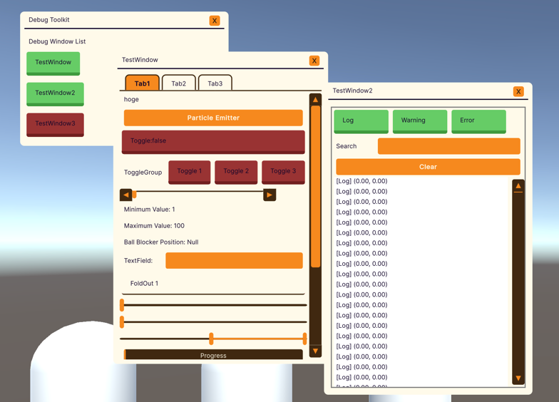
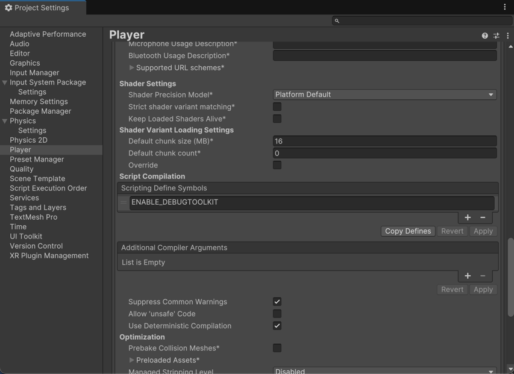
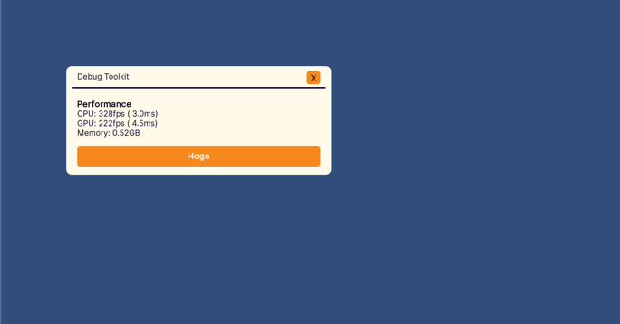
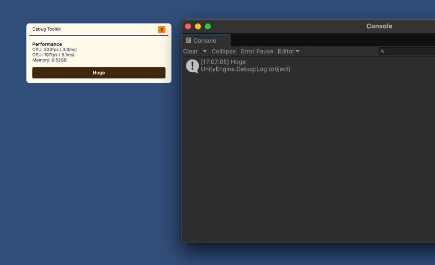
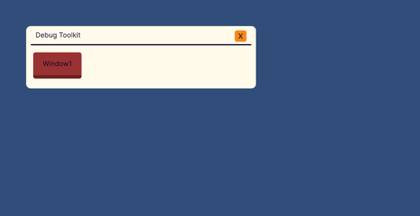
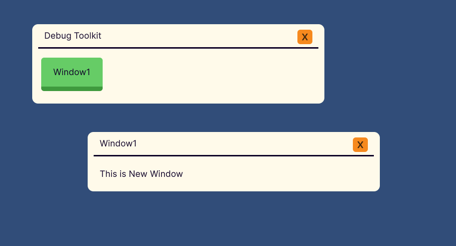
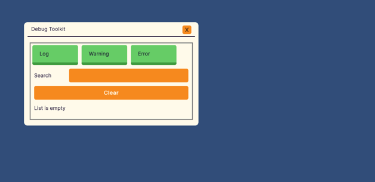
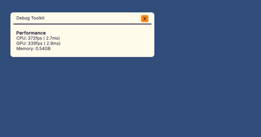
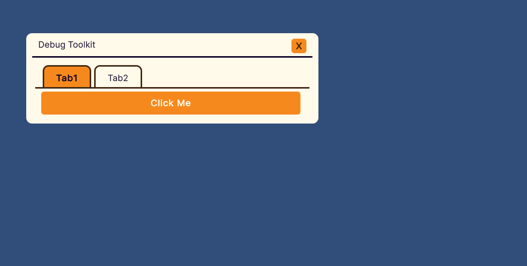

[](https://github.com/AndanteTribe/DebugToolkit/actions/workflows/unity-test.yml)
[](https://deepwiki.com/AndanteTribe/DebugToolkit)
[](README.md)
# DebugToolkit

DebugToolkitはランタイム上のデバッグメニューを簡単に実装できるライブラリです。



## 概要

DebugToolkitは、Unity UIToolkitを使用してランタイム上でデバッグメニューを簡単に実装できるライブラリです。
各UI要素のUSSを記述することなく、C#スクリプトのみで迅速にデバッグUIを構築できます。
また、デバッグウィンドウの作成、パフォーマンス情報の表示、コンソールログの表示、履歴機能付きテキストフィールドなど、開発・デバッグに便利な機能を提供します。

### コンセプト
DebugToolkitは以下のコンセプトに基づいて設計されています。

1. C#コードのみでデバッグ機能を追加できる
2. エンジニアはUIのレイアウトやスタイルを考慮しなくてよい
3. ミニマルで依存関係が少ない

## クイックスタート

### インストール

[このURL](https://github.com/AndanteTribe/DebugToolkit/releases)からUnity Packageをダウンロード、もしくはPackage Managerから以下のURLを使用してインストール

```
https://github.com/AndanteTribe/DebugToolkit.git?path=Packages/jp.andantetribe.debugtoolkit
```

### セットアップ
Project Settings > Player > Other Settings > Script Compilation > Scripting Define Symbolsに``ENABLE_DEBUGTOOLKIT``を追加

### 基本的な使用方法

1. `DebugViewerBase`を継承したクラスを作成
2. `CreateViewGUI()`メソッドをオーバーライド
3. `CreateViewGUI()`内でデバッグメニューを実装
4. Runtimeで`Start()`を呼び出す

### 例

```csharp
using DebugToolkit;
using UnityEngine;
using UnityEngine.UIElements;

public class MyDebugView : DebugViewerBase
{
    protected override VisualElement CreateViewGUI()
    {
        var root = base.CreateViewGUI();

        // パフォーマンス情報を追加
        root.AddProfileInfoLabel();

        // ボタンを追加
        var button = new Button() { text = "Hoge" };
        button.RegisterCallback<ClickEvent>(_ => Debug.Log("Hoge"));
        root.Add(button);

        return root;
    }
}
```

```csharp
using UnityEngine;

public class DebugInitializer : MonoBehaviour
{
    private MyDebugView _debugView;

    void Start()
    {
        _debugView = new MyDebugView();
        // デバッグメニューを構築
        _debugView.Start();
    }
}
```



### 全表示非表示
DebugToolkitを使用中、画面下に全表示非表示ボタンが表示されます。
全表示非表示ボタンを押すことで、すべてのデバッグメニューの表示非表示を切り替えることができます。
また、消してしまったウィンドウも再表示することができます。

## サンプル

Package Managerから`Samples`をインポートすることで、サンプルをダウンロードすることができます。

## 拡張メソッド

### ``VisualElement AddWindow(this VisualElement root, string windowName)``
新しいデバッグウィンドウを追加します。
```csharp
public class MyDebugView : DebugViewerBase
{
    protected override VisualElement CreateViewGUI()
    {
        var root = base.CreateViewGUI();

        var window = root.AddWindow("Window1");
        window.Add(new Label("This is New Window"));

        return root;
    }
}
```



### `void AddConsoleView(this VisualElement root)`
コンソールログビューを追加します。
ランタイム上でUnityのコンソールログを確認できます。
```csharp
public class MyDebugView : DebugViewerBase
{
    protected override VisualElement CreateViewGUI()
    {
        var root = base.CreateViewGUI();

        root.AddConsoleView();

        return root;
    }
}
```


### `void AddProfileInfoLabel(this VisualElement root)`
パフォーマンスを確認できるラベルを追加します。
```csharp
public class MyDebugView : DebugViewerBase
{
    protected override VisualElement CreateViewGUI()
    {
        var root = base.CreateViewGUI();

        root.AddProfileInfoLabel();

        return root;
    }
}
```


### Unity 2023.2以降


### `ScrollView AddTab(this TabView tabView, string label = "")`
TabViewに新しいタブを追加

### `(TabView,  ScrollView) AddTab(this VisualElement root, string label = "")`
VisualElementにTabViewとタブを追加

```csharp
public class MyDebugView : DebugViewerBase
{
    protected override VisualElement CreateViewGUI()
    {
        var root = base.CreateViewGUI();

        var (tabView, scrollView) = root.AddTab("Tab1");
        tabView.AddTab("Tab2");
        scrollView.Add(new Button(() => { Debug.Log("Button Clicked!"); }) { text = "Click Me" });

        return root;
    }
}
```


## カスタムUI要素

### `HistoryTextField`
履歴機能付きテキストフィールドです。
`Ctrl or Cmd + Z`でUndo, `Ctrl or Cmd + Y`もしくは`Ctrl or Cmd + Shift + Z`でRedoに対応しています。
```csharp
public class MyDebugView : DebugViewerBase
{
    protected override VisualElement CreateViewGUI()
    {
        var root = base.CreateViewGUI();
        var historyTextField = new HistoryTextField("Input");
        historyTextField.RegisterValueChangedCallback(evt => Debug.Log(evt.newValue));
        root.Add(historyTextField);
        return root;
    }
}
```

## システム要件

- Unity 2021.3以降
- UIElements (UIToolkit)

## ライセンス

このライブラリはMITライセンスの下で提供されています。
