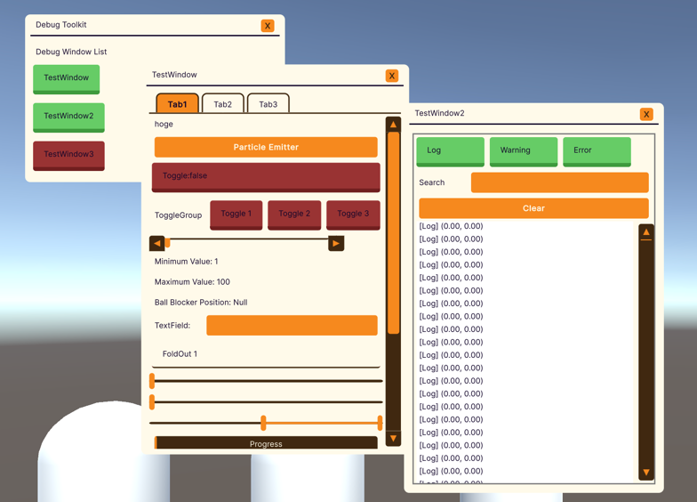

[](https://github.com/AndanteTribe/DebugToolkit/actions/workflows/unity-test.yml)
[](https://deepwiki.com/AndanteTribe/DebugToolkit)
[](README.md)
# DebugToolkit

---

UIToolkitを使ってランタイム上のデバックメニューを簡単に実装できるライブラリです。



---

## 概要

---

DebugToolkitは、Unity UIToolkitを使用してランタイム上でデバッグメニューを簡単に実装できるライブラリです。
各UI要素のUSSを記述することなく、C#スクリプトのみで迅速にデバッグUIを構築できます。
また、デバッグウィンドウの作成、パフォーマンス情報の表示、コンソールログの表示、履歴機能付きテキストフィールドなど、開発・デバッグに便利な機能を提供します。

### コンセプト
Unityでランタイム上のデバックメニューを作成する際、エンジニアは

## クイックスタート

---

### インストール

[このURL](https://github.com/AndanteTribe/DebugToolkit/releases)からUnity Packageをダウンロード、もしくはPackage Managerから以下のURLを使用してインストール

```
https://github.com/AndanteTribe/DebugToolkit.git?path=Packages/jp.andantetribe.debugtoolkit
```

### 基本的な使用方法

1. `DebugViewerBase`を継承したクラスを作成
2. `CreateViewGUI()`メソッドをオーバーライド
3. `CreateViewGUI()`内でデバッグメニューを実装
4. Runtimeで`Start()`を呼び出す

```csharp
using DebugToolkit;
using UnityEngine;
using UnityEngine.UIElements;

public class MyDebugView : DebugViewerBase
{
    protected override VisualElement CreateViewGUI()
    {
        var root = base.CreateViewGUI();

        // パフォーマンス情報を追加
        root.AddProfileInfoLabel();

        // ボタンを追加
        var button = new Button() { text = "Hoge" };
        button.RegisterCallback<ClickEvent>(_ => Debug.Log("Hoge"));

        return root;
    }
}
```

```csharp
using UnityEngine;

public class DebugInitializer : MonoBehaviour
{
    private MyDebugView debugView;

    void Start()
    {
        debugView = new MyDebugView();
        // デバッグメニューを構築
        debugView.Start();
    }
}
```

## サンプル

---

Package Managerから`Samples`をインポートすることで、サンプルをダウンロードすることができます。


## 拡張メソッド

### ウィンドウ関連
- `AddWindow(string windowName)`: 新しいデバッグウィンドウを作成
- `AddConsoleView()`: コンソールログビューを追加
- `AddProfileInfoLabel()`: パフォーマンス情報ラベルを追加

### タブ関連（Unity 2023.2以降）
- `AddTab(string label)`: TabViewに新しいタブを追加
- `AddTab(this VisualElement root, string label)`: VisualElementにTabViewとタブを追加

### ユーティリティ
- `GetSafeAreaContainer()`: セーフエリアコンテナを取得
- `GetAllDebugWindows()`: 全てのデバッグウィンドウを取得

## 基本的な機能

### ウィンドウ管理
- **ドラッグ移動**: ウィンドウヘッダーをドラッグして移動可能
- **表示/非表示切り替え**: マスターウィンドウからの一括制御
- **最前面表示**: クリックしたウィンドウが最前面に
- **削除ボタン**: Xボタンでウィンドウを非表示

### パフォーマンス監視
- **CPU/GPU フレームレート**: リアルタイムでのfps表示
- **メモリ使用量**: GB単位でのメモリ使用量表示
- **更新間隔設定**: 表示更新の間隔をカスタマイズ可能

### コンソール機能
- **ログレベルフィルタ**: Log/Warning/Error別の表示切り替え
- **検索機能**: ログメッセージの検索
- **スタックトレース**: 詳細なエラー情報の表示
- **ログクリア**: ログ履歴のクリア機能

## 対応済みVisualElement要素

### 基本要素
- `VisualElement`: 基本コンテナ
- `Button`: ボタン
- `Label`: テキスト表示
- `TextField`: テキスト入力
- `Toggle`: チェックボックス
- `ListView`: リスト表示
- `ScrollView`: スクロール可能エリア

### 専用要素
- `DebugWindow`: ドラッグ可能なウィンドウ
- `SafeAreaContainer`: セーフエリア対応コンテナ
- `HistoryTextField`: Undo/Redo機能付きテキストフィールド

### Unity 2023.2以降
- `TabView`: タブビュー
- `Tab`: 個別タブ

## システム要件

- Unity 2021.3以降
- UIElements モジュール

## ライセンス

---

このライブラリはMITライセンスの下で提供されています。

```
https://github.com/AndanteTribe/DebugToolkit.git?path=Packages/jp.andantetribe.debugtoolkit
```
