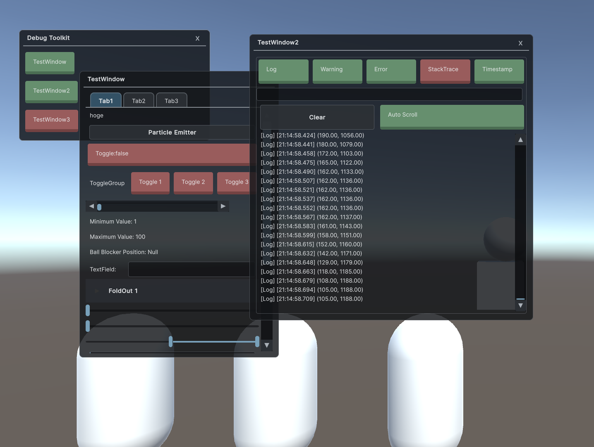
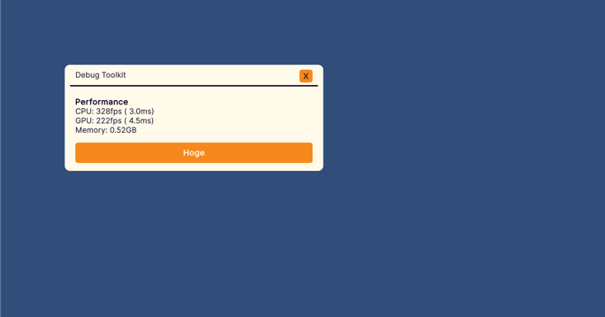
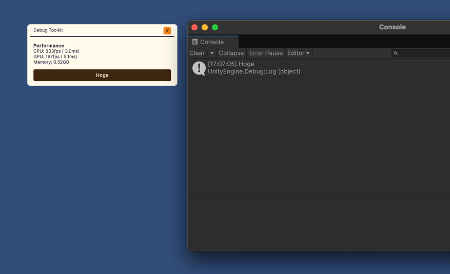
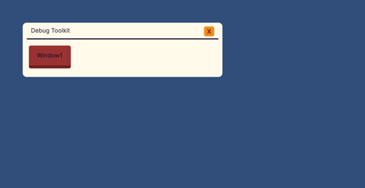
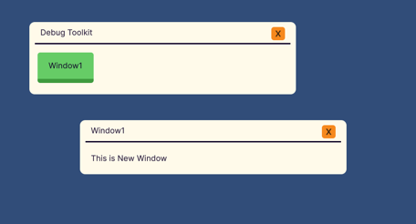
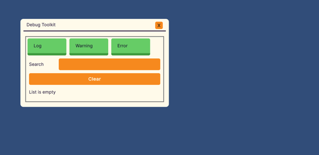
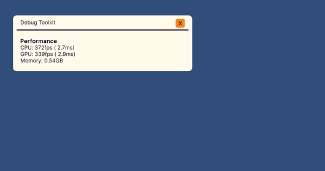
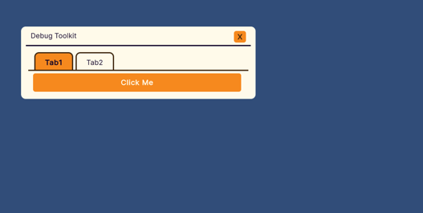

[](https://github.com/AndanteTribe/DebugToolkit/actions/workflows/unity-test.yml)
[](https://deepwiki.com/AndanteTribe/DebugToolkit)
[](README.md)
# DebugToolkit

DebugToolkitはランタイム上のデバッグメニューを簡単に実装できるライブラリです。



## 概要

DebugToolkitは、Unity UIToolkitを使用してランタイム上でデバッグメニューを簡単に実装できるライブラリです。
各UI要素のUSSを記述することなく、C#スクリプトのみで迅速にデバッグUIを構築できます。
また、デバッグウィンドウの作成、パフォーマンス情報の表示、コンソールログの表示、履歴機能付きテキストフィールドなど、開発・デバッグに便利な機能を提供します。

### コンセプト
DebugToolkitは以下のコンセプトに基づいて設計されています。

1. C#コードのみでデバッグ機能を追加できる
2. エンジニアはUIのレイアウトやスタイルを考慮しなくてよい
3. ミニマルで依存関係が少ない

## クイックスタート

### インストール

[このURL](https://github.com/AndanteTribe/DebugToolkit/releases)からUnity Packageをダウンロード、もしくはPackage Managerから以下のURLを使用してインストール

```
https://github.com/AndanteTribe/DebugToolkit.git?path=Packages/jp.andantetribe.debugtoolkit
```

### セットアップ

DebugToolkitはインストール後、デフォルトで有効になります。追加のセットアップは不要です。

**オプション:** DebugToolkitを完全に無効にしたい場合は、Project Settings > Player > Other Settings > Script Compilation > Scripting Define Symbolsに`DISABLE_DEBUGTOOLKIT`を追加してください。

### 基本的な使用方法

1. `DebugViewerBase`を継承したクラスを作成
2. `CreateViewGUI()`メソッドをオーバーライド
3. `CreateViewGUI()`内でデバッグメニューを実装
4. Runtimeで`Start()`を呼び出す

### 例

```csharp
#if !DISABLE_DEBUGTOOLKIT
using DebugToolkit;
using UnityEngine;
using UnityEngine.UIElements;

public class MyDebugView : DebugViewerBase
{
    protected override VisualElement CreateViewGUI()
    {
        var root = base.CreateViewGUI();

        // パフォーマンス情報を追加
        root.AddProfileInfoLabel();

        // ボタンを追加
        var button = new Button() { text = "Hoge" };
        button.RegisterCallback<ClickEvent>(_ => Debug.Log("Hoge"));
        root.Add(button);

        return root;
    }
}
#endif
```

```csharp
#if !DISABLE_DEBUGTOOLKIT
using UnityEngine;

public class DebugInitializer : MonoBehaviour
{
    private MyDebugView _debugView;

    void Start()
    {
        _debugView = new MyDebugView();
        // デバッグメニューを構築
        _debugView.Start();
    }
}
#endif
```



### 全表示非表示
DebugToolkitを使用中、画面下に全表示非表示ボタンが表示されます。
全表示非表示ボタンを押すことで、すべてのデバッグメニューの表示非表示を切り替えることができます。
また、消してしまったウィンドウも再表示することができます。

#### キーボードショートカット

`ToggleAllVisibleKey`を設定すると、キー入力でも同じ切り替えができます。
非表示にしてしまった固定のデバッグメニュー（マスターウィンドウ）も、このキーで呼び戻せます。
デフォルトは`KeyCode.None`（無効）です。

```csharp
#if !DISABLE_DEBUGTOOLKIT
_debugView = new MyDebugView
{
    // F1キーで全表示・全非表示を切り替える
    ToggleAllVisibleKey = KeyCode.F1,

    // 修飾キーが必要な場合（例: Shift + F1）
    ToggleAllVisibleKeyModifiers = EventModifiers.Shift,
};
_debugView.Start();
#endif
```

キーはDebugToolkitが描画しているパネルで受け取ります。
他のUIToolkitパネルがキーボードフォーカスを持っている場合はショートカットが発火しないため、
その場合は自前の入力処理から`DebugViewerBase.ToggleAllVisible()`を直接呼んでください。

## サンプル

Package Managerから`Samples`をインポートすることで、サンプルをダウンロードすることができます。

## 拡張メソッド

### ``VisualElement AddWindow(this VisualElement root, string windowName)``
新しいデバッグウィンドウを追加します。
```csharp
#if !DISABLE_DEBUGTOOLKIT
public class MyDebugView : DebugViewerBase
{
    protected override VisualElement CreateViewGUI()
    {
        var root = base.CreateViewGUI();

        var window = root.AddWindow("Window1");
        window.Add(new Label("This is New Window"));

        return root;
    }
}
#endif
```



### `void AddConsoleView(this VisualElement root)`
コンソールログビューを追加します。
ランタイム上でUnityのコンソールログを確認できます。
```csharp
#if !DISABLE_DEBUGTOOLKIT
public class MyDebugView : DebugViewerBase
{
    protected override VisualElement CreateViewGUI()
    {
        var root = base.CreateViewGUI();

        root.AddConsoleView();

        return root;
    }
}
#endif
```


### `void AddProfileInfoLabel(this VisualElement root)`
パフォーマンスを確認できるラベルを追加します。
```csharp
#if !DISABLE_DEBUGTOOLKIT
public class MyDebugView : DebugViewerBase
{
    protected override VisualElement CreateViewGUI()
    {
        var root = base.CreateViewGUI();

        root.AddProfileInfoLabel();

        return root;
    }
}
#endif
```


### Unity 2023.2以降


### `ScrollView AddTab(this TabView tabView, string label = "")`
TabViewに新しいタブを追加

### `(TabView,  ScrollView) AddTab(this VisualElement root, string label = "")`
VisualElementにTabViewとタブを追加

```csharp
#if !DISABLE_DEBUGTOOLKIT
public class MyDebugView : DebugViewerBase
{
    protected override VisualElement CreateViewGUI()
    {
        var root = base.CreateViewGUI();

        var (tabView, scrollView) = root.AddTab("Tab1");
        tabView.AddTab("Tab2");
        scrollView.Add(new Button(() => { Debug.Log("Button Clicked!"); }) { text = "Click Me" });

        return root;
    }
}
#endif
```


## カスタムUI要素

### `HistoryTextField`
履歴機能付きテキストフィールドです。
`Ctrl or Cmd + Z`でUndo, `Ctrl or Cmd + Y`もしくは`Ctrl or Cmd + Shift + Z`でRedoに対応しています。
```csharp
#if !DISABLE_DEBUGTOOLKIT
public class MyDebugView : DebugViewerBase
{
    protected override VisualElement CreateViewGUI()
    {
        var root = base.CreateViewGUI();
        var historyTextField = new HistoryTextField("Input");
        historyTextField.RegisterValueChangedCallback(evt => Debug.Log(evt.newValue));
        root.Add(historyTextField);
        return root;
    }
}
#endif
```

## テーマのカスタマイズ

DebugToolkitの見た目は`ExternalResources/`以下のUSSで定義されています。
基底色は低彩度（ほぼ無彩色）で、面は半透明にしてあるため、ゲーム画面の上に重ねても
背景の色と喧嘩せず、下のゲーム画面も透けて見えます。

### 構成

責務ごとにファイルを分割し、`DebugToolkitUss.uss`が`@import`でまとめています。
importの順序には意味があります（同じ詳細度のルールは後勝ちのため）。

| ファイル | 内容 |
| --- | --- |
| `Parts/Variables.uss` | 色・余白のトークン定義。他のシートはここだけを参照する |
| `Parts/Base.uss` | ウィンドウの器、Label、BaseFieldなどの土台 |
| `Parts/Buttons.uss` | Button / ButtonGroup / ToggleButtonGroup |
| `Parts/Fields.uss` | TextField / Toggle / RadioButton / Popup / Enum / Dropdown / Vector系 / Bounds |
| `Parts/Sliders.uss` | Slider / MinMaxSlider / Scroller / ScrollView / ProgressBar |
| `Parts/Containers.uss` | Foldout / Box / HelpBox / GroupBox / TabView / TwoPaneSplitView |
| `Parts/Collections.uss` | ListView / TreeView / MultiColumnListView |
| `Parts/Window.uss` | デバッグウィンドウ、ヘッダ、コンソールなどDebugToolkit固有の要素 |

### 状態表現の規約

すべてのインタラクティブ要素が同じトークンで同じように状態を表します。

| 状態 | 表現 |
| --- | --- |
| `:hover` | 地色を1段明るく（`*-hover`） |
| `:active` | 地色を1段暗く（`*-active`） |
| `:focus` | 枠線の色を`--debug-toolkit-color-focus`に変える（枠幅は変えないのでレイアウトがずれない） |
| `:checked` | `--debug-toolkit-color-selected`（トグルのON/OFFのみsuccess / danger） |
| `:disabled` | `*-disabled`と`--debug-toolkit-color-text-disabled` |

### 色を変える

`:root`のカスタムプロパティを自分のUSSで上書きすれば、パッケージを改変せずに配色を変えられます。

```css
:root {
    /* もっと透けさせる */
    --debug-toolkit-color-surface: rgba(20, 22, 25, 0.5);
    /* アクセントをプロジェクトの色に合わせる */
    --debug-toolkit-color-accent: rgb(200, 140, 60);
}
```

主なトークンは以下の通りです（全量は`Parts/Variables.uss`を参照）。

| トークン | 用途 |
| --- | --- |
| `--debug-toolkit-neutral-00`〜`-10` | 低彩度の基底ランプ（暗い→明るい） |
| `--debug-toolkit-color-surface` | ウィンドウ本体の面（半透明） |
| `--debug-toolkit-color-surface-raised` / `-sunken` | 区画の面 / 入力欄など凹んだ面 |
| `--debug-toolkit-color-surface-overlay` | ドロップダウンなど透けると困る面 |
| `--debug-toolkit-color-control` / `-hover` / `-active` / `-disabled` | 操作可能な部品の地色 |
| `--debug-toolkit-color-accent` / `-hover` / `-active` / `-disabled` | つまみ・進捗などのアクセント |
| `--debug-toolkit-color-selected` / `-hover` | 選択状態 |
| `--debug-toolkit-color-focus` | フォーカス枠 |
| `--debug-toolkit-color-success` / `-danger` / `-warning` | ON/OFFとログ種別 |
| `--debug-toolkit-color-text` / `-dim` / `-disabled` | 文字色 |

実行時の状態に応じてC#から直接指定している色（ログ行の地色、ウィンドウ一覧のトグル）は
`DebugConst.StyleColor`にまとまっています。USSのトークンと対になっているので、
片方を変えたらもう片方も合わせてください。

## システム要件

- Unity 2021.3以降
- UIElements (UIToolkit)

## ライセンス

このライブラリはMITライセンスの下で提供されています。
